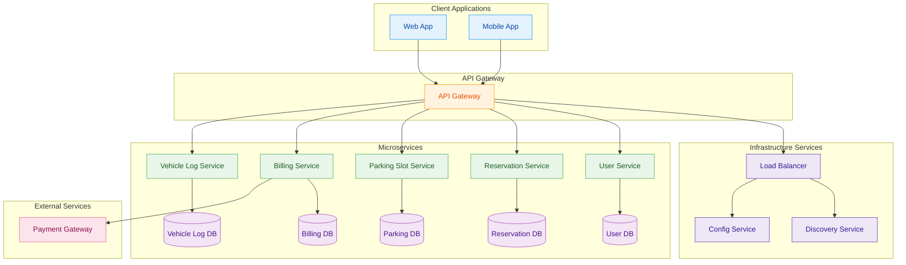

# Vehicle Parking Management System
## Table of Contents
1. [Introduction](#1-introduction)
2. [Overview](#2-overview)
3. [Features](#3-features)
4. [Technologies Used](#4-technologies-used)
    - [Backend (Spring Boot Microservices)](#backend-spring-boot-microservices)
    - [Frontend (React)](#frontend-react)
    - [Database](#database)
5. [Architectural Diagram](#5-architectural-diagram)
6. [Module Overview](#6-module-overview)
    - [User Management](#61-user-management)
    - [Parking Slot Management](#62-parking-slot-management)
    - [Vehicle Entry & Exit Logging](#63-vehicle-entry--exit-logging)
    - [Reservation System](#64-reservation-system)
    - [Billing and Payments](#65-billing-and-payments)
7. [API Gateway](#7-api-gateway)
8. [Discovery Server (Eureka)](#8-discovery-server-eureka)
9. [Deployment Strategy](#9-deployment-strategy)
10. [Database Design](#10-database-design)
11. [Non-Functional Requirements](#11-non-functional-requirements)
12. [Assumptions and Constraints](#12-assumptions-and-constraints)
13. [Folder Structure](#13-folder-structure)
14. [Setup Instructions](#14-setup-instructions)
15. [Contact](#11-contact)

### 1. Introduction
The Vehicle Parking Management System is a comprehensive solution for managing parking operations efficiently. It supports real-time operations for both visitors and subscribers.

### 2. Overview
The Vehicle Parking Management System is designed to facilitate efficient parking slot management, vehicle entry/exit logging, reservations, and billing operations. It supports both visitor and subscriber parking operations in real time and is compatible with Java (Spring Boot) frameworks for backend development.

### 3. Features
1. **Parking Slot Management**: Manage parking slots, including adding, updating, deleting, and searching for availability.
2. **User Management**: Handle user registration, login, and role-based access control for admins, staff, and customers.
3. **Vehicle Logging**: Track vehicle entry and exit processes, updating parking slot statuses in real time.
4. **Reservation System**: Enable users to book, modify, or cancel parking slots seamlessly.
5. **Billing and Payments**: Generate bills dynamically based on parking duration and process payments securely.

### 4. Technologies Used

#### Backend (Spring Boot Microservices)
- **Spring Boot**: Framework for building robust, standalone, production-grade Spring applications.
- **Spring Cloud**: For building distributed systems (e.g., Service Discovery with Eureka, API Gateway with Zuul/Gateway).
- **Java 21**: Programming language.
- **Maven**: Build automation tool.
- **Spring Data JPA**: For database interaction.
- **Spring Security**: For authentication and authorization.
- **Lombok**: Reduces boilerplate code.
- **JUnit & Mockito**: For unit and integration testing.

#### Frontend (React)
- **React (with Create React App/Vite)**: JavaScript library for building user interfaces.
<!-- - **TypeScript (Optional, but recommended)**: Typed superset of JavaScript.
- **React Router Dom**: For navigation and routing.
- **Axios**: For making HTTP requests to the backend.
- **Tailwind CSS (or Material-UI/Chakra UI/styled-components)**: For styling and responsive design.
- **React Query (or Redux/Zustand)**: For state management and data fetching.
- **Jest & React Testing Library**: For testing React components.
- **npm / yarn**: Package manager. -->

#### Database
- **MySQL**: Relational database for storing application data.
- **MySQL Workbench**: Database management tool.

### 5. Architectural Diagram



### 6. Module Overview
#### 6.1 User Management
Manages user registration, login, and role-based access control for admins, staff, and customers. Ensures secure authentication and authorization processes.
- [User Service](./user-service/README.md)

#### 6.2 Parking Slot Management
Handles parking slot operations such as adding, updating, and checking availability. Maintains real-time status of parking slots.
- [Parking Slot Service](./parking-slot-service/README.md)

#### 6.3 Vehicle Entry & Exit Logging
Logs vehicle movements and updates parking slot statuses dynamically. Provides a seamless tracking mechanism for entry and exit.
- [Vehicle Log Service](./vehicle-log-service/README.md)

#### 6.4 Reservation System
Enables users to book, modify, or cancel parking slots. Ensures smooth reservation management with real-time updates.
- [Reservation Service](./reservation-service/README.md)

#### 6.5 Billing and Payments
Generates bills based on parking duration and processes payments securely. Supports multiple payment methods for user convenience.

### 7. API Gateway
- Acts as a single entry point for all frontend requests.
- Routes requests to appropriate backend services.

### 8. Discovery Server (Eureka)
- Facilitates service discovery for microservices in the system.
- Ensures seamless communication between services.

### 9. Deployment Strategy
#### 9.1 Local Development
- Frontend served via React dev server.  
- Backend run with Spring Boot.  
- Database setup using local MySQL instance.  

---

### 10. Database Design
| Table Name   | Primary Key   | Foreign Keys         |  
|--------------|---------------|----------------------|  
| User         | UserID        | –                    |  
| ParkingSlot  | SlotID        | –                    |  
| VehicleLog   | LogID         | UserID, SlotID       |  
| Reservation  | ReservationID | UserID, SlotID       |  
| Invoice      | InvoiceID     | UserID               |  

### 11. Non-Functional Requirements
- **Performance**: Support 200+ concurrent users in development/test setups.
- **Scalability**: Horizontal scalability using containerization (optional in the future).
- **Security**: Role-based access, encrypted password storage, HTTPS for all data exchange.
- **Usability**: Responsive and mobile-friendly UI, WCAG-compliant design.

### 12. Assumptions and Constraints
#### 12.1 Assumptions
- Each slot accommodates only one vehicle.
- Entry/exit operations are manual.

#### 12.2 Constraints
- SMS/Email notifications are out of scope.
- Third-party integrations are not included in this phase.

---

### 13. Folder Structure
```
vehicle-parking-management-system
├── eureka-discovery-service
│   ├── src
│   │   ├── main
│   │   │   ├── java
│   │   │   │   └── com
│   │   │   │       └── parking
│   │   │   │           └── discovery
│   │   │   │               └── EurekaDiscoveryServiceApplication.java
│   │   │   └── resources
│   │   │       ├── application.properties
│   │   │       └── bootstrap.yml
│   ├── pom.xml
│   └── README.md
├── api-gateway
│   ├── src
│   │   ├── main
│   │   │   ├── java
│   │   │   │   └── com
│   │   │   │       └── parking
│   │   │   │           └── gateway
│   │   │   │               └── ApiGatewayApplication.java
│   │   │   └── resources
│   │   │       ├── application.properties
│   │   │       └── bootstrap.yml
│   ├── pom.xml
│   └── README.md
├── user-service
│   ├── src
│   │   ├── main
│   │   │   ├── java
│   │   │   │   └── com
│   │   │   │       └── parking
│   │   │   │           └── user
│   │   │   │               ├── controllers
│   │   │   │               │   └── UserController.java
│   │   │   │               ├── entities
│   │   │   │               │   └── User.java
│   │   │   │               ├── repositories
│   │   │   │               │   └── UserRepository.java
│   │   │   │               ├── services
│   │   │   │               │   └── UserService.java
│   │   │   │               └── dtos
│   │   │   │                   └── UserDTO.java
│   │   │   └── resources
│   │   │       ├── application.properties
│   │   │       └── bootstrap.yml
│   ├── pom.xml
│   └── README.md
├── parking-slot-service
│   ├── src
│   │   ├── main
│   │   │   ├── java
│   │   │   │   └── com
│   │   │   │       └── parking
│   │   │   │           └── slot
│   │   │   │               ├── controllers
│   │   │   │               │   └── ParkingSlotController.java
│   │   │   │               ├── entities
│   │   │   │               │   └── ParkingSlot.java
│   │   │   │               ├── repositories
│   │   │   │               │   └── ParkingSlotRepository.java
│   │   │   │               ├── services
│   │   │   │               │   └── ParkingSlotService.java
│   │   │   │               └── dtos
│   │   │   │                   └── ParkingSlotDTO.java
│   │   │   └── resources
│   │   │       ├── application.properties
│   │   │       └── bootstrap.yml
│   ├── pom.xml
│   └── README.md
├── vehicle-log-service
│   ├── src
│   │   ├── main
│   │   │   ├── java
│   │   │   │   └── com
│   │   │   │       └── parking
│   │   │   │           └── log
│   │   │   │               ├── controllers
│   │   │   │               │   └── VehicleLogController.java
│   │   │   │               ├── entities
│   │   │   │               │   └── VehicleLog.java
│   │   │   │               ├── repositories
│   │   │   │               │   └── VehicleLogRepository.java
│   │   │   │               ├── services
│   │   │   │               │   └── VehicleLogService.java
│   │   │   │               └── dtos
│   │   │   │                   └── VehicleLogDTO.java
│   │   │   └── resources
│   │   │       ├── application.properties
│   │   │       └── bootstrap.yml
│   ├── pom.xml
│   └── README.md
├── reservation-service
│   ├── src
│   │   ├── main
│   │   │   ├── java
│   │   │   │   └── com
│   │   │   │       └── parking
│   │   │   │           └── reservation
│   │   │   │               ├── controllers
│   │   │   │               │   └── ReservationController.java
│   │   │   │               ├── entities
│   │   │   │               │   └── Reservation.java
│   │   │   │               ├── repositories
│   │   │   │               │   └── ReservationRepository.java
│   │   │   │               ├── services
│   │   │   │               │   └── ReservationService.java
│   │   │   │               └── dtos
│   │   │   │                   └── ReservationDTO.java
│   │   │   └── resources
│   │   │       ├── application.properties
│   │   │       └── bootstrap.yml
│   ├── pom.xml
│   └── README.md
├── billing-service
│   ├── src
│   │   ├── main
│   │   │   ├── java
│   │   │   │   └── com
│   │   │   │       └── parking
│   │   │   │           └── billing
│   │   │   │               ├── controllers
│   │   │   │               │   └── BillingController.java
│   │   │   │               ├── entities
│   │   │   │               │   └── Invoice.java
│   │   │   │               ├── repositories
│   │   │   │               │   └── InvoiceRepository.java
│   │   │   │               ├── services
│   │   │   │               │   └── BillingService.java
│   │   │   │               └── dtos
│   │   │   │                   └── InvoiceDTO.java
│   │   │   └── resources
│   │   │       ├── application.properties
│   │   │       └── bootstrap.yml
│   ├── pom.xml
│   └── README.md
└── README.md
```

<!-- ### 14. Setup Instructions
#### 14.1 Prerequisites
- Install Java 11 or higher.
- Install Node.js and npm.
- Install MySQL.

#### 14.2 Clone the Repository
```bash
git clone https://github.com/your-repo/MicroservicesVehicleParkingManagementSystem.git
cd MicroservicesVehicleParkingManagementSystem
```

#### 14.3 Configure the Database
- Create a new database in MySQL for the application.
- Update the `src/main/resources/application.properties` file with the following details:
    ```properties
    spring.datasource.url=jdbc:mysql://localhost:3306/your_database_name
    spring.datasource.username=your_username
    spring.datasource.password=your_password
    spring.jpa.hibernate.ddl-auto=update
    ```
- Replace `your_database_name`, `your_username`, and `your_password` with your actual database details.
- Ensure the MySQL server is running before starting the application.
- Test the connection by running the backend service.

#### 14.4 Build and Run the Application
- Build and start the backend service:
  ```bash
  ./mvnw spring-boot:run
  ```

#### 14.5 Access the API Documentation
- Open your browser and navigate to `http://localhost:8080/swagger-ui.html` to explore the API documentation. -->


### 14. Setup Instructions

#### 14.1 Prerequisites
Before you begin, ensure you have the following installed:
- **Java Development Kit (JDK) 17 or higher**: [Download JDK](https://www.oracle.com/java/technologies/javase-downloads.html)
- **Node.js (LTS version) & npm/yarn**: [Download Node.js](https://nodejs.org/)
- **Maven (or Gradle)**: [Download Maven](https://maven.apache.org/download.cgi)
- **Git**: [Download Git](https://git-scm.com/)
- **MySQL**: [Download MySQL](https://dev.mysql.com/downloads/) (and a client like MySQL Workbench)
- **Docker (Optional, but recommended for easy setup)**: [Download Docker Desktop](https://www.docker.com/products/docker-desktop)

#### 14.2 Clone the Repository
```bash
git clone https://github.com/your-username/vehicle-parking-management-system.git
cd vehicle-parking-management-system
```

#### 14.3 Backend Setup
1. **Navigate to the backend directory**:
    ```bash
    cd backend
    ```

2. **Database Configuration**:
    - Create a MySQL database (e.g., `parking_db`).
    - Update `src/main/resources/application.properties` (or `application.yml`) in each microservice to configure your database connection:
      ```properties
      spring.datasource.url=jdbc:mysql://localhost:3306/parking_db
      spring.datasource.username=your_db_username
      spring.datasource.password=your_db_password
      spring.jpa.hibernate.ddl-auto=update # or create, none
      spring.jpa.show-sql=true
      ```

3. **Build Each Microservice**:
    - Navigate into each microservice directory (e.g., `backend/user-service`, `backend/parking-lot-service`, etc.) and build them:
      ```bash
      cd user-service
      mvn clean install
      cd ../parking-lot-service
      mvn clean install
      # Repeat for all services (reservation-service, api-gateway, eureka-server, etc.)
      ```
    - Alternatively, build the entire multi-module project from the backend root:
      ```bash
      mvn clean install
      ```

#### 14.4 Frontend Setup
1. **Navigate to the frontend directory**:
    ```bash
    cd ../frontend # if you are in backend/user-service, go back to root first: cd ../..
    cd frontend
    ```

2. **Install dependencies**:
    ```bash
    npm install # or yarn install
    ```

3. **Configure API Endpoint**:
    - The React application will communicate with your API Gateway. Ensure your `frontend/.env` file (or equivalent configuration) points to the correct backend URL:
      ```env
      REACT_APP_API_BASE_URL=http://localhost:8080 # Or whatever port your API Gateway runs on
      ```

#### 14.5 Running the Application
1. **Start MySQL Database**: Ensure your MySQL instance is running.

2. **Start Eureka Server**:
    - Navigate to `backend/eureka-server` and run:
      ```bash
      mvn spring-boot:run
      ```
    - (Wait for it to start up, typically on `http://localhost:8761`)

3. **Start Backend Microservices**:
    - In separate terminal windows, navigate to each microservice directory (e.g., `backend/user-service`, `backend/parking-lot-service`, `backend/reservation-service`) and run:
      ```bash
      mvn spring-boot:run
      ```
    - (Ensure all services register with Eureka)

4. **Start API Gateway**:
    - Navigate to `backend/api-gateway` and run:
      ```bash
      mvn spring-boot:run
      ```
    - (Typically on `http://localhost:8080`)

5. **Start Frontend React Application**:
    - Navigate to `frontend` and run:
      ```bash
      npm start # or yarn start
      ```
    - The React app will typically open in your browser at `http://localhost:3000`.


<!-- ### 15. Testing
Run the tests using Maven:
```bash
mvn test
``` -->
### 11. Contact
Team 2

Project Link: [Vehicle Parking Management System](https://github.com/your-username/vehicle-parking-management-system)


### something somethinbgg
