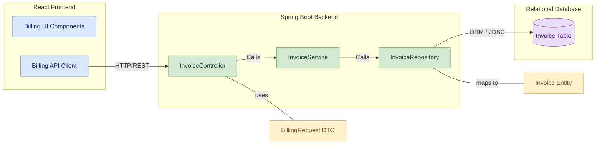
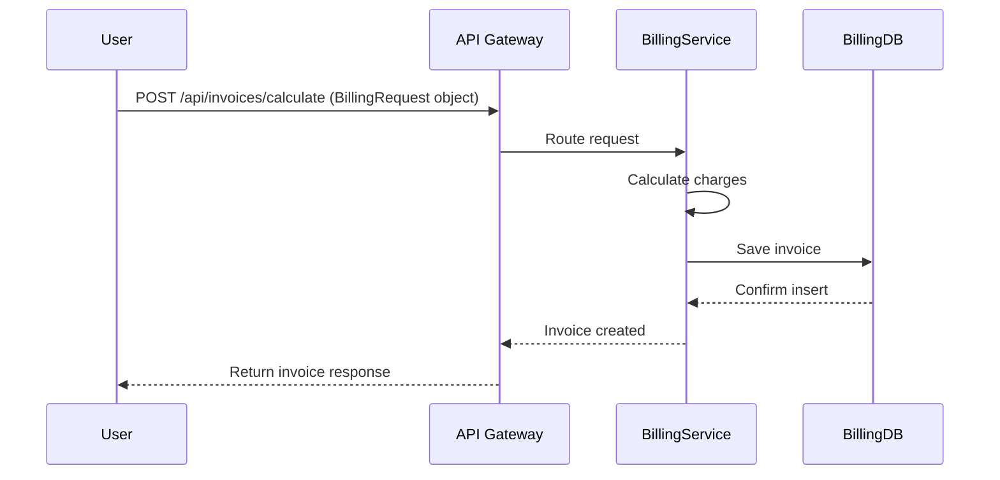

# Billing-Service Module Low-Level Documentation

This document provides a low-level overview of the `Billing-Service` module, a microservice within the Vehicle Parking Management System (VPMS) responsible for managing billing and invoice generation.

---

## Table of Contents

1. [Project Overview](#1-project-overview)  
   * [1.1 Features](#11-features)

2. [Architecture](#2-architecture)  
   * [2.1 Component Diagram](#21-component-diagram)  
   * [2.2 Sequence Diagram](#22-sequence-diagram)

3. [Database Design](#3-database-design)  
   * [3.1 Invoice Table](#31-invoice-table)

4. [API Endpoints](#4-api-endpoints)  
   * [4.1 Invoice Management](#41-invoice-management)  
   * [4.2 Swagger Documentation](#42-swagger-documentation)

5. [Error Handling](#5-error-handling)  

6. [Maven Dependencies](#6-maven-dependencies)  

7. [Deployment](#7-deployment)
   * [7.1 Steps to Deploy](#71-steps-to-deploy)

---

## 1. Project Overview

The `Billing-Service` module is a critical component of the VPMS, enabling users to calculate and generate invoices for parking services. It ensures accurate billing based on parking duration and integrates seamlessly with other modules like reservation and user management.

### 1.1 Features

- **Generate Invoices**
  - Calculates parking charges based on entry and exit times.
  - Generates invoices with payment status and method.

- **View Invoices**
  - Fetch invoices by user ID or invoice ID.
  - Supports listing all invoices for administrative purposes.

- **Calculate Charges**
  - Provides an endpoint to calculate charges dynamically based on parking duration.

---

## 2. Architecture

The `Billing-Service` follows a **layered architecture** using **Spring Boot** and communicates with other VPMS modules via REST APIs. The service relies on a relational database (e.g., MySQL) to manage persistence.

### 2.1 Component Diagram

### 2.2 Sequence Diagram



## 3. Database Design

### 3.1 Invoice Table

| Column Name       | Data Type  | Description                             |
|-------------------|------------|-----------------------------------------|
| `invoice_id`      | bigint     | Primary key, auto-generated             |
| `user_id`         | bigint     | Foreign key to User table               |
| `slot_id`         | bigint     | Foreign key to ParkingSlot table        |
| `amount`          | double     | Total parking charges                   |
| `payment_method`  | varchar    | Payment method (e.g., Cash, Card)       |
| `status`          | varchar    | Invoice status (e.g., Paid, Unpaid)     |
| `timestamp`       | datetime   | Invoice creation timestamp              |

---

## 4. API Endpoints

### 4.1 Invoice Management

| Endpoint                                | Method  | Description                      | Request/Params                          |
|-----------------------------------------|---------|----------------------------------|------------------------------------------|
| `/api/invoices`                         | POST    | Create a new invoice             | Invoice object (JSON)                   |
| `/api/invoices`                         | GET     | Get all invoices                 | None                                     |
| `/api/invoices/{id}`                    | GET     | Get invoice by ID                | `id` as path variable                   |
| `/api/invoices/calculate`               | POST    | Calculate and generate invoice   | BillingRequest object (JSON)            |

---

### 4.2 Swagger Documentation

Comprehensive API documentation is available via Swagger UI, typically accessible at:  
[**http://localhost:8085/swagger-ui.html**](http://localhost:8085/swagger-ui.html)

---

## 5. Error Handling

The module uses Spring Boot's global exception handling mechanisms to ensure consistent and descriptive error responses.

| HTTP Status Code | Description                          |
|------------------|--------------------------------------|
| `400 Bad Request`| Invalid input or request parameters  |
| `404 Not Found`  | Invoice does not exist               |
| `500 Internal Server Error` | Unexpected server-side failure |

All error responses include a message and timestamp, aiding in debugging and user communication.

---

## 6. Maven Dependencies
 
The `pom.xml` file defines the project's dependencies and build configuration. Key dependencies include:
- **spring-boot-starter-web**: For RESTful web applications.
- **spring-boot-starter-data-jpa**: For JPA and Hibernate integration.
- **spring-boot-starter-actuator**: For monitoring and management.
- **spring-boot-starter-security**: For security features (if implemented).
- **spring-boot-starter-test**: For unit and integration testing.
- **spring-cloud-starter-netflix-eureka-client**: Enables service registration with Eureka.
- **lombok**: Reduces boilerplate Java code.
- **mysql-connector-j**: JDBC driver for MySQL database connection.
- **springdoc-openapi-starter-webmvc-ui**: Generates OpenAPI (Swagger) documentation.
- **spring-boot-devtools**: Provides development-time features like automatic restarts.

---
 
## 7. Deployment
 
#### Key Configuration
 
Below is an excerpt from the `application.properties` file:
 
```properties
spring.application.name=billing-service
server.port=8082
spring.datasource.url=jdbc:mysql://localhost:3306/billing_db
spring.datasource.username=root
spring.datasource.password=root
spring.datasource.driver-class-name=com.mysql.cj.jdbc.Driver
spring.jpa.hibernate.ddl-auto=update
spring.jpa.show-sql=true
eureka.client.service-url.defaultZone=http://localhost:8761/eureka/
eureka.instance.prefer-ip-address=true
eureka.instance.hostname=localhost
eureka.instance.instance-id=${spring.application.name}:${spring.application.instance_id:${random.value}}
```
 
#### 7.1 Steps to Deploy
 
1. **Clone the Repository**  
    ```bash
    git clone <repository-url>
    ```
 
2. **Navigate to the Project Directory**  
    ```bash
    cd billing-service
    ```
 
3. **Build the Project**  
    ```bash
    mvn clean install
    ```
 
4. **Run the Application**  
    ```bash
    mvn spring-boot:run
    ```
 
Ensure that the Eureka server and MySQL database are running before starting the application.
 
---
 
### Note
 
Ensure MySQL is running and the `billing_db` database exists.  
Eureka server should be running on port `8761` for service registration.  
Swagger UI is available at `/swagger-ui.html` for API exploration.
