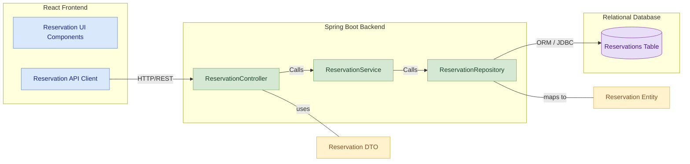
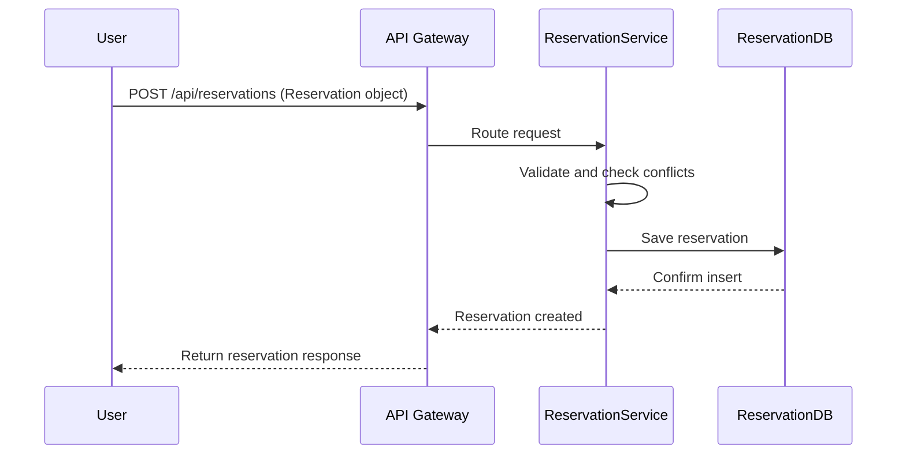

# Reservation-Service Module Low-Level Documentation

This document provides a low-level overview of the `Reservation-Service` module, a microservice within the Parking Management System (PMS) responsible for managing parking slot reservations.

---

## Table of Contents

1. [Project Overview](#1-project-overview)  
   * [1.1 Features](#11-features)

2. [Architecture](#2-architecture)  
   * [2.1 Component Diagram](#21-component-diagram)  
   * [2.2 Sequence Diagram](#22-sequence-diagram)

3. [Database Design](#3-database-design)  
   * [3.1 Reservation Table](#31-reservation-table)

4. [API Endpoints](#4-api-endpoints)  
   * [4.1 Reservation Management](#41-reservation-management)  
   * [4.2 Swagger Documentation](#42-swagger-documentation)

5. [Error Handling](#5-error-handling)  

6. [Maven Dependencies](#6-maven-dependencies)  

7. [Deployment](#7-deployment)
   * [7.1 Steps to Deploy](#71-steps-to-deploy)

---


## 1. Project Overview

The `Reservation-Service` module is a critical component of the PMS, enabling users to create, update, view, and cancel parking slot reservations. It ensures data integrity, prevents double bookings, and works seamlessly with user and slot management services.

### 1.1 Features

- **Create Reservations**
  - Accepts requests to book a parking slot for a specific time frame.
  - Validates availability before creating a record.
  - Prevents overlapping reservations for the same slot.

- **View Reservations**
  - Fetch reservations by user ID or reservation ID.
  - Supports filtering and sorting for better usability.

- **Update Reservations**
  - Allows modification of slot, time window, or vehicle number.
  - Validates updated data to avoid conflicts.

- **Cancel Reservations**
  - Allows users to cancel an existing reservation.
  - Updates reservation status accordingly by checking slot availability.

---

## 2. Architecture

The `Reservation-Service` follows a **layered architecture** using **Spring Boot** and communicates with other PMS modules via REST APIs. The service relies on a relational database (e.g., MySQL or H2) to manage persistence.

### 2.1 Component Diagram



### 2.2 Sequence Diagram



## 3. Database Design

### 3.1 Reservation Table

| Column Name       | Data Type  | Description                             |
|-------------------|------------|-----------------------------------------|
| `reservation_id`  | bigint     | Primary key, auto-generated             |
| `user_id`         | bigint     | Foreign key to User table               |
| `slot_id`         | bigint     | Foreign key to ParkingSlot table        |
| `vehicle_number`  | varchar    | Vehicle registration number             |
| `start_time`      | datetime   | Reservation start time                  |
| `end_time`        | datetime   | Reservation end time                    |
| `status`          | varchar    | Reservation status (e.g., Active, Canceled) |

---

## 4. API Endpoints

### 4.1 Reservation Management

| Endpoint                                | Method  | Description                      | Request/Params                          |
|-----------------------------------------|---------|----------------------------------|------------------------------------------|
| `/api/reservations`                     | POST    | Create a new reservation         | Reservation object (JSON)               |
| `/api/reservations/user/{userId}`       | GET     | Get reservations for a user      | `userId` as path variable                |
| `/api/reservations/{id}`                | GET     | Get reservation by ID            | `id` as path variable                    |
| `/api/reservations/{id}`                | PUT     | Update an existing reservation   | Updated fields in request body          |
| `/api/reservations/{id}`                | DELETE  | Cancel a reservation             | `id` as path variable                    |

---

### 4.2 Swagger Documentation

Comprehensive API documentation is available via Swagger UI, typically accessible at:  
[**http://localhost:8080/swagger-ui.html**](http://localhost:8080/swagger-ui.html)


---

## 5. Error Handling

The module uses Spring Boot's global exception handling mechanisms to ensure consistent and descriptive error responses.

| HTTP Status Code | Description                          |
|------------------|--------------------------------------|
| `400 Bad Request`| Invalid input or request parameters  |
| `404 Not Found`  | Reservation does not exist           |
| `409 Conflict`   | Overlapping reservation or slot issue|
| `500 Internal Server Error` | Unexpected server-side failure |

All error responses include a message and timestamp, aiding in debugging and user communication.

---
## 6. Maven Dependencies
 
The `pom.xml` file defines the project's dependencies and build configuration. Key dependencies include:
- **spring-boot-starter-web**: For RESTful web applications.
- **spring-boot-starter-data-jpa**: For JPA and Hibernate integration.
- **spring-boot-starter-actuator**: For monitoring and management.
- **spring-boot-starter-security**: For security features (if implemented).
- **spring-boot-starter-test**: For unit and integration testing.
- **spring-cloud-starter-netflix-eureka-client**: Enables service registration with Eureka.
- **lombok**: Reduces boilerplate Java code.
- **mysql-connector-j**: JDBC driver for MySQL database connection.
- **springdoc-openapi-starter-webmvc-ui**: Generates OpenAPI (Swagger) documentation.
- **spring-boot-devtools**: Provides development-time features like automatic restarts.

---
 
## 7. Deployment
 
#### Key Configuration
 
Below is an excerpt from the `application.properties` file:
 
```properties
spring.application.name=reservation-service
server.port=8082
spring.datasource.url=jdbc:mysql://localhost:3306/reservation_db
spring.datasource.username=root
spring.datasource.password=root
spring.datasource.driver-class-name=com.mysql.cj.jdbc.Driver
spring.jpa.hibernate.ddl-auto=update
spring.jpa.show-sql=true
eureka.client.service-url.defaultZone=http://localhost:8761/eureka/
eureka.instance.prefer-ip-address=true
eureka.instance.hostname=localhost
eureka.instance.instance-id=${spring.application.name}:${spring.application.instance_id:${random.value}}
```
 
#### 7.1 Steps to Deploy
 
1. **Clone the Repository**  
    ```bash
    git clone <repository-url>
    ```
 
2. **Navigate to the Project Directory**  
    ```bash
    cd reservation-service
    ```
 
3. **Build the Project**  
    ```bash
    mvn clean install
    ```
 
4. **Run the Application**  
    ```bash
    mvn spring-boot:run
    ```
 
Ensure that the Eureka server and MySQL database are running before starting the application.
 
---
 
### Note
 
Ensure MySQL is running and the `reservation_db` database exists.  
Eureka server should be running on port `8761` for service registration.  
Swagger UI is available at `/swagger-ui.html` for API exploration.
