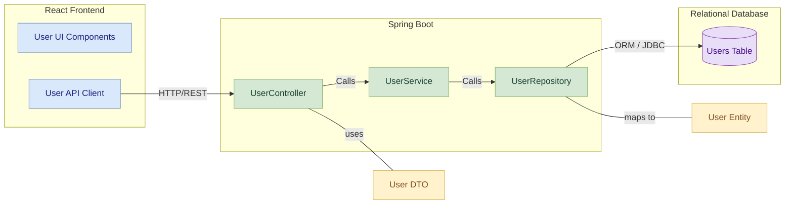
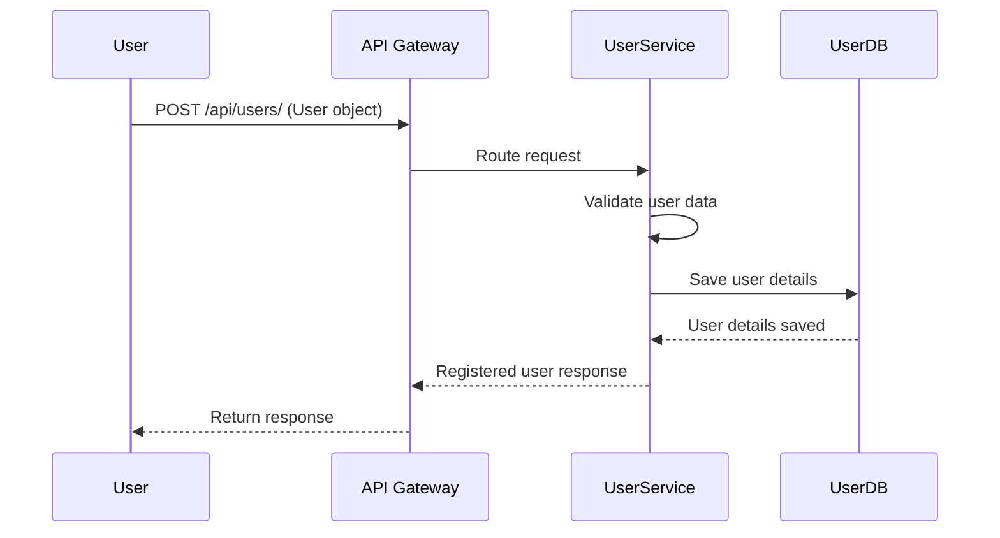

# User-Service Module: Low-Level Design Document

This document provides a detailed low-level overview of the `User-Service` module, a crucial microservice within the Parking Management System (PMS) responsible for all user-related operations.

---

## Table of Contents
1. [Introduction](#1-introduction)  
    * [1.1 Features](#11-features)  
2. [Architecture](#2-architecture)  
    * [2.1 Component Diagram](#21-component-diagram)
    * [2.2 User Registration Sequence Diagram](#22-user-registration-sequence-diagram) 
3. [Database Design](#3-database-design)  
    * [3.1 User Table](#31-user-table)  
4. [API Endpoints](#4-api-endpoints)  
    * [4.1 User Management Endpoints](#41-user-management-endpoints)  
    * [4.2 Swagger Documentation](#42-swagger-documentation)  
5. [Error Handling](#5-error-handling)  
    * [5.1 Common Error Codes](#51-common-error-codes)  
6. [Dependencies](#6-dependencies)  
    * [6.1 Key Dependencies](#61-key-dependencies)  
7. [Deployment](#7-deployment)  
    * [7.1 Key Configuration](#71-key-configuration)  

---

## 1. Introduction

The **`User-Service`** is a core component of the Vehicle Parking Management System, dedicated to managing user-specific functionalities. It handles operations such as user creation, retrieval, and role management, interacting with a database to persist and retrieve user information.

### 1.1 Features

- **User Registration**  
    - Allows new users to register with essential details.  
    - Validates input and prevents duplicates.  
    - Securely hashes passwords.

- **User Retrieval**  
    - **By ID:** Fetch specific user by ID.  
    - **All Users:** List all users with pagination/filtering.

- **Role Management**  
    - Assigns roles (e.g., Admin, User).  
    - Enforces role-based access.  
    - Supports role updates.

- **User Profile Management**  
    - View/update personal user profiles.  
    - Authorized users only.

---

## 2. Architecture

The `User-Service` is built using **Spring Boot** with a **layered architecture** and communicates via REST APIs. Uses **H2** for in-memory DB during local development.

### 2.1 Component Diagram


### 2.2 User Registration Sequence Diagram



 

---

## 3. Database Design

### 3.1 User Table

| Column Name | Data Type | Description                    |
|-------------|-----------|--------------------------------|
| id          | Long      | Primary key (auto-generated)   |
| name        | String    | Name of the user               |
| email       | String    | Email address of the user      |
| phone       | String    | Phone number of the user       |
| role        | String    | Role of the user (e.g., Admin) |

---

## 4. API Endpoints

### 4.1 User Management Endpoints

| Endpoint           | Method | Description             | Request Body/Params |
|--------------------|--------|-------------------------|---------------------|
| /api/users/        | POST   | Register a new user     | User object         |
| /api/users/{id}    | GET    | Retrieve user by ID     | Path Variable       |
| /api/users         | GET    | Retrieve all users      | None                |


### 4.2 Swagger Documentation

Comprehensive API documentation is available via Swagger UI, typically accessible at:  
[**http://localhost:8080/swagger-ui.html**](http://localhost:8080/swagger-ui.html)

**Available Endpoints:**

| HTTP Method | Endpoint | Description |
|-------------|----------|-------------|
| GET         | `/swagger-ui.html#/UserController/getAllUsers` | Retrieve all users |
| POST        | `/swagger-ui.html#/UserController/createUser`  | Add a new user |
| GET         | `/swagger-ui.html#/UserController/getUserById` | Retrieve a user by ID |
| DELETE      | `/swagger-ui.html#/UserController/deleteUserById` | Delete a user by ID |


---

## 5. Error Handling

Spring Boot’s global exception handling returns appropriate HTTP codes for clear client communication.

### 5.1 Common Error Codes

| Error Code | Description                             |
|------------|-----------------------------------------|
| 400        | Bad Request (e.g., invalid input)        |
| 404        | Not Found (e.g., user doesn't exist)     |
| 500        | Internal Server Error                    |

---

## 6. Dependencies

### 6.1 Key Dependencies

- `spring-boot-starter-web`  
- `spring-boot-starter-data-jpa`  
- `h2-database`  
- `lombok`  
- `junit`, `mockito`

---

## 7. Deployment

Service can be built and deployed using Maven.

### 7.1 Key Configuration

Defined in `application.properties`:

```properties
spring.application.name=user-service
server.port=8010
spring.datasource.url=jdbc:h2:file:./data/userDB;DB_CLOSE_DELAY=-1;DB_CLOSE_ON_EXIT=FALSE
spring.datasource.driver-class-name=org.h2.Driver
spring.datasource.username=sa
spring.datasource.password=
spring.jpa.hibernate.ddl-auto=update
```
