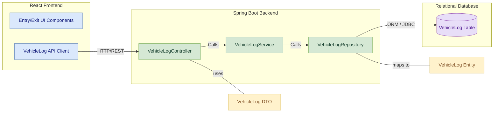
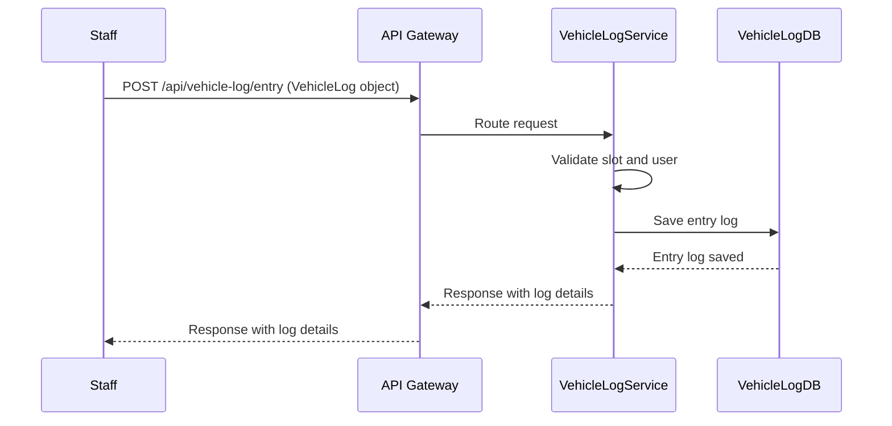

# VehicleLog-Service Module Low-Level Documentation

This document provides a low-level overview of the `VehicleLog-Service` module, a microservice within the Parking Management System (PMS) responsible for managing vehicle entry and exit operations.

---

 ## Table of Contents

1. [Project Overview](#1-project-overview)
   - [1.1 Features](#11-features)
2. [Architecture](#2-architecture)
   - [2.1 Component Diagram](#21-component-diagram)
   - [2.2 Sequence Diagram](#22-sequence-diagram)
3. [Database Design](#3-database-design)
   - [3.1 VehicleLog-Service Table](#31-vehiclelog-service-table)
4. [API Endpoints](#4-api-endpoints)
   - [4.1 Vehicle Log Management](#41-vehicle-log-management)
   - [4.2 Swagger Documentation](#42-swagger-documentation)
5. [Error Handling](#5-error-handling)
   - [5.1 Common Error Codes](#51-common-error-codes) 
6. [Maven Dependencies](#6-maven-dependencies)
7. [Deployment](#7-deployment)
   - [7.1 Run Locally](#71-run-locally)


 

   
## 1. Project Overview

The `VehicleLog-Service` module is a core component of the Parking Management System (PMS), dedicated to tracking vehicle movements. It handles operations such as logging vehicle entry and exit, updating parking slot occupancy, and calculating parking duration for billing purposes.

### 1.1 Features

- **Log vehicle entry**
  - Records the entry time of a vehicle into a parking slot.
  - Validates slot availability and user association.
  - Updates the slot status to occupied.

- **Log vehicle exit**
  - Records the exit time of a vehicle from a parking slot.
  - Calculates the total duration of parking.
  - Updates the slot status to available.

- **Retrieve vehicle log by ID**
  - Enables fetching specific vehicle log details using a unique log ID.
  - Returns entry time, exit time, vehicle number, slot ID, and user ID.

- **Retrieve all vehicle logs**
  - Provides functionality to fetch all vehicle logs in the system.
  - Supports pagination and filtering for efficient data handling.
  - Returns a list of logs with basic details.

---

## 2. Architecture

The `VehicleLog-Service` module is built using the **Spring Boot** framework and adheres to a **layered architecture**. It communicates with other services via **REST APIs** and utilizes **H2** as its database for local development purposes.

### 2.1 Component Diagram


### 2.2 Sequence Diagram



## 3. Database Design

### 3.1 VehicleLog-Service Table

The `VehicleLog-Service` module utilizes the following table:


| Column Name     | Data Type | Description                          |
|-----------------|-----------|--------------------------------------|
| `logId`         | Long      | Primary key (auto-generated)         |
| `vehicleNumber` | String    | Vehicle registration number          |
| `entryTime`     | Timestamp | Time of vehicle entry                |
| `exitTime`      | Timestamp | Time of vehicle exit                 |
| `slotId`        | String    | Foreign key to ParkingSlot           |
| `userId`        | String    | Foreign key to User                  |

---

## 4. API Endpoints

### 4.1 Vehicle Log Management

| Endpoint                        | Method | Description           | Request Body/Params     |
|--------------------------------|--------|-----------------------|--------------------------|
| `/api/vehicle-log/entry`       | POST   | Log vehicle entry     | VehicleLog object        |
| `/api/vehicle-log/exit/{logId}`| POST   | Log vehicle exit      | `logId` (Path Variable)  |
| `/api/vehicle-log`             | GET    | Retrieve all logs     | None                     |


### 4.2 Swagger Documentation

Detailed API documentation can be found via Swagger UI, typically available at `/swagger-ui.html` when the service is running.

---

## 5. Error Handling

The module leverages Spring Boot's exception handling mechanisms to return appropriate HTTP status codes for errors, ensuring clear communication of issues to client applications.

### 5.1 Common Error Codes

| Error Code | Description           |
|------------|-----------------------|
| `400`      | Bad Request           |
| `404`      | Resource Not Found    |
| `500`      | Internal Server Error |

---

## 6. Maven Dependencies

The `pom.xml` file defines the project's dependencies and build configuration. Key dependencies include:

### Spring Boot Starters
- **spring-boot-starter-web**: For RESTful web applications.
- **spring-boot-starter-data-jpa**: For JPA and Hibernate integration.
- **spring-boot-starter-actuator**: For monitoring and management.
- **spring-boot-starter-security**: For security features (if implemented).
- **spring-boot-starter-test**: For unit and integration testing.

### Spring Cloud Netflix Eureka Client
- **spring-cloud-starter-netflix-eureka-client**: Enables service registration with Eureka.

### Lombok
- **lombok**: Reduces boilerplate Java code.

### MySQL Connector/J
- **mysql-connector-j**: JDBC driver for MySQL database connection.

### SpringDoc OpenAPI Starter WebMVC UI
- **springdoc-openapi-starter-webmvc-ui**: Generates OpenAPI (Swagger) documentation.

### Spring Boot DevTools
- **spring-boot-devtools**: Provides development-time features like automatic restarts.


---

## 7. Deployment

## 7.1 Run Locally

```bash
# Clone this repo
git clone <repository-url>

# Navigate to the folder
cd member-service

# Build and run
mvn clean install
mvn spring-boot:run

